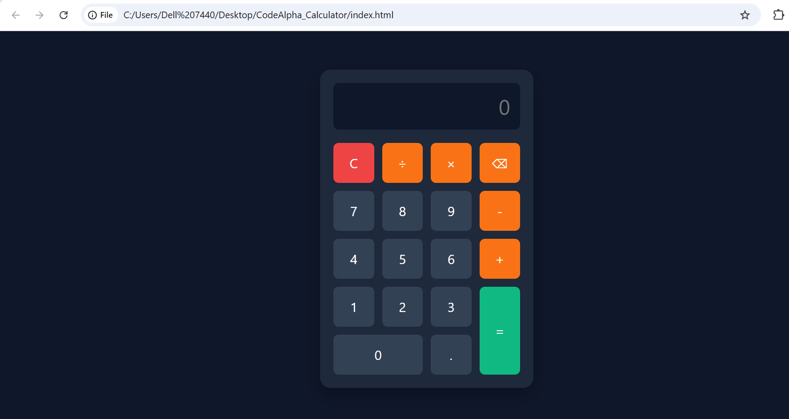

# CodeAlpha - Build a Calculator

A sleek, modern, and fully responsive calculator built using HTML, CSS, and JavaScript as part of the CodeAlpha Web Development Internship.

## Features
- **Basic Arithmetic Operations**: Supports addition, subtraction, multiplication, and division.
- **Modern Dark UI**: Designed with a clean, dark aesthetic and interactive hover/click animations.
- **Keyboard Support**: Fully functional keyboard inputs (numbers, operators, Enter for calculation, Backspace, and Escape to clear).
- **Responsive Layout**: Adapts perfectly to both mobile screens and desktops.

## Tech Stack
- HTML5
- CSS3 (Grid & Flexbox)
- JavaScript (ES6+)

## Screenshots

